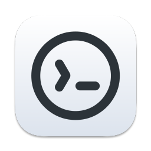
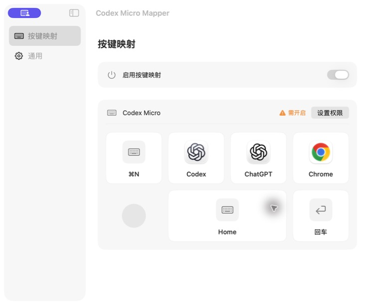

# Codex Micro Mapper

[简体中文](README.zh-CN.md) · English

Mix global shortcuts and app actions on **Layer 1 of Codex Micro**.

Customize the keyboard’s bottom two rows without switching layers.

[Download](https://github.com/levineet/codex-micro-mapper/releases/latest) · macOS 14+ · Apple Silicon

## What you can assign

- **Global shortcuts**: record a key combination or choose a single key, including left and right modifiers.
- **App actions**: open, activate or hide an app, or send a shortcut after activating it.

## Get started

1. Download, unzip and move the app to Applications. The current build is locally signed and has not been notarized by Apple.
2. In Codex, set the bottom two rows to **Empty 1–5 and Yolo**. See the [key layout](docs/SETUP.md).
3. Open Mapper, grant **Input Monitoring** and **Accessibility**, then click a key to assign an action.

## Privacy

Processing stays on your Mac. The app does not upload data or keep a typing history. Shortcut recording temporarily reads key events; ACT12 placeholder verification reads selected text. See [privacy details](PRIVACY.md).

---

[Setup and troubleshooting](docs/SETUP.md) · [Contributing](CONTRIBUTING.md) · [Report an issue](https://github.com/levineet/codex-micro-mapper/issues)

By **Steve** · [MIT license](LICENSE) · An independent project, not affiliated with Work Louder or OpenAI.
